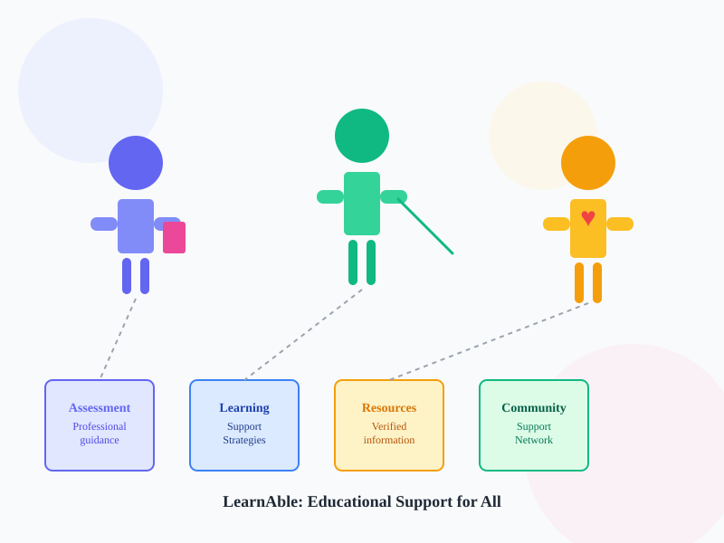

# LearnAble - Learning Disability Awareness & Support Portal

## Project Overview

**LearnAble** is a Community Engagement Project (B.Sc. IT) that provides a comprehensive, non-diagnostic educational platform for awareness, assessment guidance, and support resources related to learning disabilities.

### Mission
To create a centralized, user-friendly platform that:
- Builds awareness about learning disabilities
- Explains assessment pathways
- Provides practical support strategies
- Connects users with verified resources
- Serves learners, parents, and educators

### Important Disclaimer
**⚠️ CRITICAL:** This portal provides **educational awareness only**. It does NOT:
- Diagnose learning disabilities
- Recommend medications
- Replace professional assessment
- Provide clinical or medical advice

If concerns persist, users must consult qualified professionals (psychologists, special educators, clinical professionals).

---

## Technology Stack

- **Frontend:** HTML5, CSS3, JavaScript (Vanilla)
- **Styling:** Modern responsive CSS with CSS variables
- **Data Storage:** localStorage (client-side) for prototype
- **Icons:** Unicode emoji and SVG illustrations
- **PWA:** Manifest.json and service worker ready
- **Accessibility:** WCAG 2.1 compliant
- **Deployment:** GitHub Pages

---

## Project Structure

```
learnable-cea/
├── index.html                 # Homepage with hero section
├── about.html                 # About learning disabilities
├── learning-areas.html        # Reading, Writing, Spelling, etc.
├── assessment.html            # Assessment pathway guide
├── learner.html              # Learner support strategies
├── parent.html               # Parent/caregiver guidance
├── educator.html             # Educator support strategies
├── activities.html           # Interactive learning activity
├── resources.html            # Resource directory with search/filter
├── faq.html                  # Frequently asked questions
├── feedback.html             # Feedback form
├── login.html                # Admin login (demo credentials)
├── admin.html                # Admin dashboard
│
├── css/
│   └── style.css             # Comprehensive responsive styling
│
├── js/
│   ├── app.js               # Core app initialization
│   ├── accessibility.js     # Accessibility features (text size, contrast)
│   ├── activities.js        # Interactive quiz logic
│   ├── resources.js         # Resource directory with search/filter
│   ├── feedback.js          # Feedback form handling
│   └── admin.js             # Admin dashboard logic
│
├── images/
│   └── hero-illustration.svg # Scalable SVG illustration
│
├── manifest.json            # PWA manifest
├── service-worker.js        # Service worker for offline support
├── README.md                # This file
└── .gitignore              # Git ignore rules
```

---

## Features

### 1. **Homepage (index.html)**
- Hero section with compelling headline
- User pathway cards (Learner, Parent, Educator)
- Learning disability overview
- Timeline of assessment process
- Call-to-action boxes
- FAQ preview

### 2. **Educational Modules**

#### Module 1: About Learning Disabilities
- Definition and characteristics
- Common misconceptions
- Intelligence vs. learning differences
- Temporary vs. persistent difficulties

#### Module 2: Learning Areas
- Reading, Writing, Spelling, Comprehension, Mathematics
- Possible difficulties and strategies
- When to seek professional help

#### Module 3: Assessment Guide
- Step-by-step assessment pathway (8 steps)
- Clear messaging: "This site does not diagnose"
- Professional referral guidance

#### Module 4: Learner Support
- Study planning and task breaking
- Reading and writing strategies
- Memory techniques and time management
- Exam preparation tips

#### Module 5: Parent/Caregiver Support
- Communication techniques
- Homework support strategies
- Positive learning environment creation
- Teacher collaboration
- Professional referral guidance

#### Module 6: Educator Support
- Inclusive classroom strategies
- Differentiated learning methods
- Clear instruction techniques
- Parent-teacher collaboration

#### Module 7: Interactive Activity
- 10-question educational quiz
- NOT diagnostic or named as a "test"
- Score-based feedback
- Links to educational resources
- Clear disclaimer on results

#### Module 8: Resource Directory
- Search functionality
- Category filtering
- Verified organization information
- External links with source attribution
- Verification date display

#### Module 9: FAQ
- Expandable accordion cards
- Common questions answered
- Clear, simple language
- No medical advice

#### Module 10: Feedback
- Name (optional), user type, rating (1-5)
- Feedback textarea
- Suggestions textarea
- localStorage storage
- No sensitive child data collection

#### Module 11: Admin Dashboard
- Simple admin login (username: `admin`, password: `admin123`)
- Dashboard statistics
- Resource management (add/edit/delete)
- Feedback viewer
- Activity tracking
- localStorage persistence

---

## Design Features

### Visual Design
- **Color Scheme:** Professional blue/purple (#6366f1) primary with supporting colors
- **Typography:** System fonts for accessibility
- **Spacing:** Consistent use of CSS variables for spacing
- **Cards:** Modern card-based layout with hover effects
- **Icons:** Unicode emoji and SVG illustrations
- **Buttons:** Multi-style buttons (primary, secondary, outline)

### Responsive Design
- **Mobile-first approach**
- **Breakpoints:** 768px (tablet), 480px (mobile)
- **Flexible grids:** CSS Grid and Flexbox
- **Touch-friendly:** Large tap targets (44px+)
- **Readable fonts:** 16px+ base size

### Accessibility Features
- **Skip-to-content link**
- **Keyboard navigation:** Full keyboard support
- **Focus states:** Visible focus indicators
- **ARIA labels:** Semantic HTML and ARIA attributes
- **Color contrast:** WCAG AA compliant
- **Text alternatives:** Alt text for all images
- **Accessibility toolbar:**
  - Increase/Decrease text size
  - High contrast mode toggle
  - Reset to defaults
  - Settings saved in localStorage

---

## How to Run Locally

### Prerequisites
- Python 3 (or any HTTP server)
- Git
- Browser (Chrome, Firefox, Safari, Edge)

### Setup Instructions

1. **Clone the repository:**
   ```bash
   git clone https://github.com/sanchitachavan90-design/learnable-cea.git
   cd learnable-cea
   ```

2. **Switch to the project branch:**
   ```bash
   git checkout initial-webapp
   ```

3. **Start a local server:**

   **Using Python:**
   ```bash
   python3 -m http.server 8000
   ```

   **Or using Python 2:**
   ```bash
   python -m SimpleHTTPServer 8000
   ```

   **Or using Node.js (http-server):**
   ```bash
   npx http-server -p 8000
   ```

4. **Open in browser:**
   ```
   http://localhost:8000
   ```

5. **Navigate the application:**
   - Homepage loads with all modules
   - Use navbar to explore each section
   - Test responsive design by resizing browser
   - Try accessibility toolbar (bottom-right)
   - Test admin login with `admin/admin123`

---

## Testing Checklist

### TC01: Homepage
- [ ] Hero section displays properly
- [ ] User pathway cards are clickable
- [ ] All sections render correctly
- [ ] Images/SVG load without errors
- [ ] Disclaimer is visible and clear

### TC02: Navigation
- [ ] All navbar links work
- [ ] Mobile menu toggles correctly
- [ ] Active link highlights current page
- [ ] Language selector is present

### TC03: Responsive Design
- [ ] Desktop view (1200px+) - side-by-side layouts
- [ ] Tablet view (768px) - cards stack appropriately
- [ ] Mobile view (480px) - full-width, readable
- [ ] Images scale properly
- [ ] Text remains readable

### TC04: Feedback Validation
- [ ] Form requires all fields
- [ ] User type dropdown works
- [ ] Rating radio buttons select correctly
- [ ] Submission stores in localStorage
- [ ] Success message appears

### TC05: Activity Logic
- [ ] Quiz loads with questions
- [ ] Radio buttons select answers
- [ ] Progress bar advances
- [ ] Previous/Next buttons work
- [ ] Score calculation is accurate
- [ ] Results show feedback
- [ ] Restart button works

### TC06: Resource Filtering
- [ ] Search box filters by name/description
- [ ] Category dropdown filters correctly
- [ ] Combined search + filter works
- [ ] Resource links open in new tab
- [ ] No results message appears when appropriate

### TC07: External Resource Links
- [ ] All resource links are valid
- [ ] Links open in new tabs
- [ ] No broken 404 errors
- [ ] Source attribution is visible

### TC08: Accessibility
- [ ] Skip-to-content link works
- [ ] Keyboard-only navigation possible
- [ ] Focus indicators visible
- [ ] Color contrast meets WCAG AA
- [ ] Screen reader navigation works
- [ ] Accessibility toolbar functions

### TC09: Content Accuracy
- [ ] No medical/clinical advice given
- [ ] Disclaimer visible on all pages
- [ ] Assessment guide shows 8-step process
- [ ] Learning areas are clearly labeled
- [ ] No diagnostic language used

### TC10: Privacy & Data
- [ ] No unnecessary child data collection
- [ ] Feedback stored only in localStorage
- [ ] No external analytics
- [ ] Optional name field in feedback
- [ ] Privacy notice on feedback form

---

## Admin Dashboard

### Access
- **URL:** `http://localhost:8000/login.html`
- **Username:** `admin`
- **Password:** `admin123`

⚠️ **NOTE:** This is a prototype login. In production:
- Use secure authentication (OAuth, JWT, etc.)
- Never hardcode credentials
- Implement SSL/TLS encryption
- Use role-based access control
- Store passwords with proper hashing

### Admin Features
- **Dashboard:** View statistics
- **Manage Resources:** Add, edit, delete
- **View Feedback:** Read user submissions
- **Track Activities:** Monitor usage

---

## Data Storage (localStorage)

The prototype uses browser localStorage for data persistence:

```javascript
// Resources
localStorage.getItem('learnableResources')

// Feedback
localStorage.getItem('learnableFeedback')

// Activities
localStorage.getItem('learnableActivities')

// Admin login
localStorage.getItem('adminLoggedIn')

// Accessibility settings
localStorage.getItem('accessibilitySettings')
```

### Future Migration
When ready for production:
1. Replace localStorage with a real database (Firebase, Supabase, PostgreSQL)
2. Implement secure authentication
3. Add user accounts and profiles
4. Enable data analytics
5. Implement backup and recovery

---

## GitHub Pages Deployment

### Step 1: Create GitHub Repository
```bash
git init
git add .
git commit -m "Initial LearnAble application"
git branch -M main
git remote add origin https://github.com/YOUR_USERNAME/learnable-cea.git
git push -u origin main
```

### Step 2: Enable GitHub Pages
1. Go to **Repository Settings**
2. Scroll to **Pages** section
3. Select **Deploy from branch**
4. Choose **main** branch and **/root** folder
5. Click **Save**

### Step 3: Access Published Site
- URL: `https://YOUR_USERNAME.github.io/learnable-cea/`
- Wait ~5 minutes for first deployment

### Step 4: Custom Domain (Optional)
1. Add domain in Pages settings
2. Update DNS records
3. Verify ownership

---

## Relative Paths & GitHub Pages Compatibility

All paths are **relative** for GitHub Pages compatibility:

```html
<!-- ✅ Correct -->
<link rel="stylesheet" href="css/style.css" />
<script src="js/app.js"></script>


<!-- ❌ Wrong -->
<link rel="stylesheet" href="/css/style.css" /> <!-- Absolute path -->
<script src="http://localhost:8000/js/app.js"></script> <!-- URL -->
```

---

## Explanations for Viva/Defense

### Q1: Why no diagnosis?
**A:** Learning disabilities require qualified professionals (psychologists, special educators). This portal educates about learning differences and guides toward professional assessment without making clinical claims.

### Q2: How does the activity differ from a test?
**A:** It's educational awareness content, not diagnostic. Questions teach concepts, not assess disability presence. Results emphasize "for learning only" and never label users.

### Q3: Why these learning areas (Reading, Writing, Spelling, Math)?
**A:** These are common areas where learning disabilities manifest and where teachers/parents notice difficulty. They're educational examples, not exhaustive.

### Q4: How are resources verified?
**A:** We use established organizations (NCLD, IDA, LDA, UNESCO, Understood) with verification dates. Users can verify claims and sources independently.

### Q5: Why localStorage instead of a database?
**A:** For prototyping and education purposes, localStorage is sufficient. It's JavaScript-based, requires no backend, and demonstrates full functionality for viva. Production would use Firebase/PostgreSQL.

### Q6: How is accessibility implemented?
**A:** WCAG 2.1 compliance through:
- Skip-to-content link
- Keyboard navigation
- Focus indicators
- Color contrast (4.5:1 ratio)
- Semantic HTML
- ARIA labels
- Accessible toolbar

### Q7: How does the assessment pathway guide work?
**A:** 8 steps from noticing difficulty to ongoing support, showing collaboration between parents/teachers/professionals without performing diagnosis ourselves.

### Q8: Why responsive design?
**A:** 60% of web traffic is mobile. Mobile-first design ensures accessibility for learners, parents, and teachers accessing via smartphones.

### Q9: How is content safety ensured?
**A:** Language review:
- "May experience" vs. "will have"
- "Possible difficulty" vs. "definite problem"
- "Consider seeking" vs. "must see"
- Disclaimers on every page

### Q10: What's the project's impact?
**A:** Bridges information gap for:
- Learners: Self-awareness and coping strategies
- Parents: Understanding and communication
- Educators: Inclusive teaching methods
- Communities: Awareness and reduced stigma

---

## Browser Compatibility

- ✅ Chrome/Chromium 90+
- ✅ Firefox 88+
- ✅ Safari 14+
- ✅ Edge 90+
- ✅ Mobile browsers (iOS Safari, Chrome Mobile)

---

## File Size & Performance

- **CSS:** ~25 KB (uncompressed)
- **JavaScript:** ~15 KB (total)
- **Images:** 2 KB (SVG)
- **Total:** ~42 KB (before gzip)
- **Load Time:** <1 second on 4G

---

## Future Enhancements

1. **Backend:** Firebase/Supabase integration
2. **Authentication:** User accounts
3. **Analytics:** Track engagement and demographics
4. **Multilingual:** Marathi, Hindi translations
5. **Mobile App:** React Native version
6. **API:** RESTful API for third-party integrations
7. **CMS:** Content management system for admins
8. **Chatbot:** AI-powered Q&A support
9. **Video:** Educational videos for each module
10. **Community:** Forum for peer support

---

## License

This project is open-source for educational purposes.

---

## Contact & Support

**Project:** LearnAble - Learning Disability Awareness & Support Portal
**Institution:** B.Sc. IT Program
**Organization Reference:** Ummeed Child Development Center, Mumbai
**Date:** 2024

---

## Acknowledgments

- **Design Inspiration:** Educational NGO best practices
- **Content:** Learning disability awareness organizations
- **Technology:** Vanilla HTML/CSS/JavaScript best practices
- **Accessibility:** WCAG 2.1 guidelines

---

## Support

For issues or suggestions:
1. Check this README
2. Test with Chrome DevTools
3. Review console for errors
4. Test on multiple browsers
5. Verify all relative paths

---

**Last Updated:** October 1, 2024
**Version:** 1.0.0-beta
**Status:** Ready for demonstration
